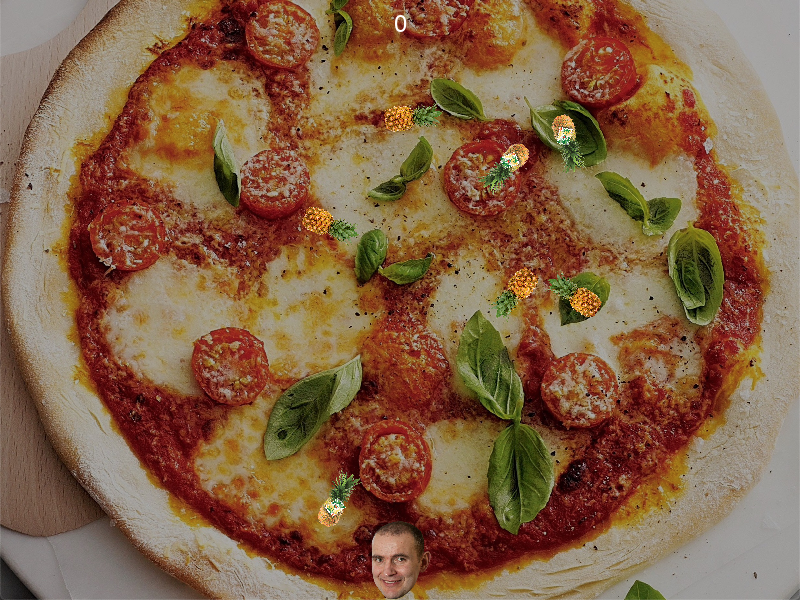

# Pizza Invaders

## Overview

Pizza Invaders is a game inspired by Space Invaders. The objective is to avoid the pineapples that fall down the screen, as you do not want them on your pizza. You play as the President of Iceland, Guðni Th. Jóhannesson.



## Controls

To start the game, press any key.

Move: `Arrow keys` (left and right)

Shoot: `Space`

Quit: `Escape`

## Setup (prebuilt)

Packaged, executable versions of the game for Windows, macOS and Linux (all 64-bit) can be downloaded from the [Releases](https://github.com/reyniraron/pizza-invaders/releases) tab.

## Setup (from source)

### Requirements

Pizza Invaders requires Python 3 and Pygame. Pipenv is recommended.

### Installation

#### Clone the repository to your computer and `cd` into it

```bash
git clone https://github.com/haframjolk/pizza-invaders.git
cd pizza-invaders
```

#### Set up a Pipenv environment for the game and activate it

```bash
pipenv install
pipenv shell
```

#### Run the game

```bash
python lokaverkefni.py
```

## Building packaged versions

### Install the development dependencies

```bash
pipenv install --dev
pipenv shell
```

### Build an executable using cx_Freeze

```bash
python setup.py [MODE]
```

Replace `[MODE]` with the appropriate mode for your use case.

#### cx_Freeze modes

| Mode      | Platform              | Output          |
| --------- | --------------------- | --------------- |
| build     | Any                   | Folder          |
| bdist_mac | macOS                 | .app bundle     |
| bdist_dmg | macOS                 | .dmg disk image |
| bdist_msi | Windows               | MSI installer   |
| bdist_rpm | Linux (Red Hat-based) | RPM package     |

If the build is successful, you will find the output in either the `dist/` or `build/` directory, depending on the mode chosen.
